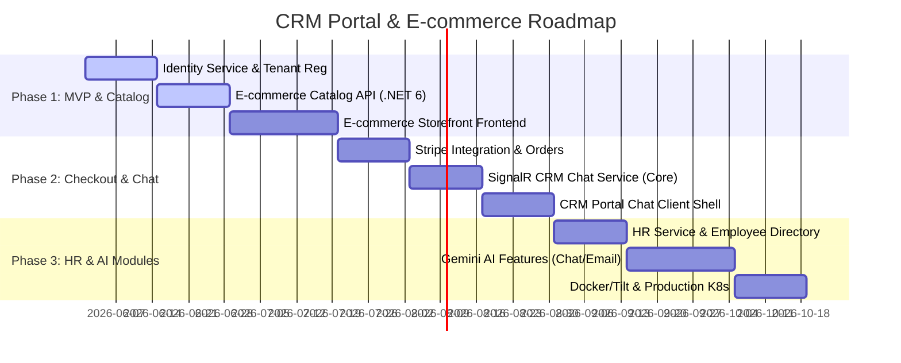

# CRM Portal & E-commerce Development Roadmap

This document outlines the phased development roadmap to construct the backend microservices (targeting .NET 6) and the Next.js frontend, balancing quick deliverables and robust scalability.

---

## Roadmap Overview

---

## 📌 Phase 1: MVP Core & Catalog (Nền tảng & Danh mục sản phẩm)
**Mục tiêu**: Xây dựng hạ tầng cơ bản, Identity Service quản trị Tenant, phân hệ E-commerce Catalog trưng bày sản phẩm len và giao diện cửa hàng trực tuyến cơ bản.

### 1. Identity & Tenant Service (.NET 6)
- Xây dựng **Identity Service**: Đăng ký Tenant (doanh nghiệp), Đăng ký tài khoản Admin và cấu hình vai trò.
- Thiết lập Redis Cache để quản lý phiên làm việc và bảo mật token JWT.

### 2. E-commerce Product Catalog Service (.NET 6)
- Triển khai **Catalog Service**: API quản lý danh mục sản phẩm đồ len, đồ handmade (hình ảnh, giá, tồn kho).
- Thiết lập cơ sở dữ liệu PostgreSQL cho Catalog Service độc lập.

### 3. Giao diện Cửa hàng E-commerce (Next.js 15)
- Dựng khung dự án Next.js 15 và thiết kế trang danh sách sản phẩm len, trang chi tiết sản phẩm.
- Tích hợp TanStack Query phục vụ đồng bộ API Catalog.

---

## 📌 Phase 2: Checkout & CRM Portal Chat (Thanh toán & Chat thời gian thực)
**Mục tiêu**: Kích hoạt cổng thanh toán đơn hàng đồ len handmade và thiết lập hệ thống chat hỗ trợ real-time giữa người mua và nhân viên vận hành.

### 1. Stripe Checkout & Orders Service
- Triển khai **Orders Service**: Quản lý giỏ hàng, đặt hàng và chuyển đổi trạng thái đơn hàng.
- Tích hợp **Stripe Checkout API** và xử lý Stripe Webhook cập nhật đơn hàng thành công bất đồng bộ qua RabbitMQ.

### 2. SignalR Chat Service (.NET 6)
- Triển khai **CRM Chat Service**: Sử dụng **SignalR (WebSockets)** thiết lập kênh chat thời gian thực.
- Thiết lập hàng đợi điều phối phiên chat (Chat session queue) trên Redis.

### 3. Giao diện Chat Portal (CRM Portal Next.js)
- Dựng khung màn hình quản trị CRM Portal dành cho nhân viên kinh doanh / hỗ trợ chat.
- Thiết lập giao diện chat trực tiếp nhận thông báo real-time khi khách mua đồ len cần tư vấn.

---

## 📌 Phase 3: HR & AI Integrations (Quản lý Nhân sự & Trí tuệ Nhân tạo)
**Mục tiêu**: Hoàn thiện các tính năng quản lý nhân sự trực ca, tích hợp Trí tuệ Nhân tạo Gemini AI và tối ưu hóa hạ tầng DevOps.

### 1. HR & Employees Service (.NET 6)
- Triển khai **HR Service**: Quản lý hồ sơ nhân viên, phân ca trực hỗ trợ chat và phân bổ công việc.
- Đồng bộ thông tin hoạt động của nhân viên hỗ trợ lên CRM Dashboard.

### 2. Tích hợp AI Gemini (AI Service)
- Xây dựng **AI Service** kết nối Gemini API:
  - Sinh mẫu câu trả lời nhanh cho rep trực chat dựa trên sản phẩm len khách đang xem.
  - Tóm tắt hội thoại chat hỗ trợ dài.
  - Chấm điểm khách mua hàng tiềm năng dựa trên giỏ hàng đồ handmade.

### 3. Tối ưu hóa hạ tầng & Kubernetes
- Hoàn thiện tệp cấu hình **Tilt** và Docker Compose chạy toàn bộ microservices cục bộ.
- Xây dựng GitHub Actions tự động kiểm thử và đẩy Docker image lên production Kubernetes.
