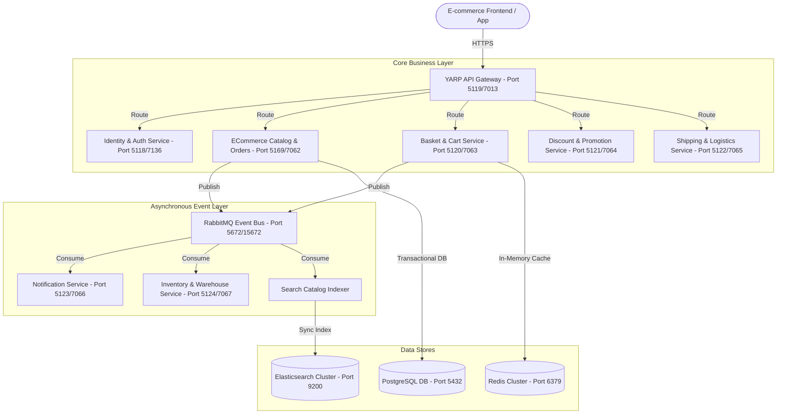

# Product & Technical Specification: Advanced E-commerce Distributed System

Tài liệu này đặc tả chi tiết về mặt nghiệp vụ và kỹ thuật cho giai đoạn nâng cấp tiếp theo của hệ thống **E-commerce Platform** (bán lẻ đồ len và handmade) theo kiến trúc Distributed Microservices, mở rộng từ MVP hiện tại để đạt chuẩn thương mại hóa hiệu năng cao.

---

## 1. 🏛️ Tổng quan Kiến trúc (Target Architecture)

Hệ thống sử dụng cơ chế định tuyến qua **YARP API Gateway**, đồng bộ hóa trạng thái bất đồng bộ qua **RabbitMQ Event Bus**, lưu trữ giỏ hàng hiệu năng cao trên **Redis Cache** và đồng bộ tìm kiếm tức thời thông qua **Elasticsearch**.



---

## 2. 📝 Chi tiết Đặc tả các dịch vụ bổ sung (Service Specifications)

### 🛒 Dịch vụ 1: Basket & Cart Service (Giỏ hàng Tạm thời)
*   **Mục tiêu**: Quản lý giỏ hàng trực tuyến của khách hàng với độ trễ dưới 5ms (Sub-millisecond latency).
*   **Giải pháp kỹ thuật**:
    *   Sử dụng **Redis** làm database chính dạng Key-Value (`basket:{userId}`).
    *   Tự động lưu trữ và phục hồi giỏ hàng khi khách hàng chuyển từ trạng thái ẩn danh sang đăng nhập (Merge Cart).
    *   Cấu hình **Time-to-Live (TTL)** giỏ hàng là 14 ngày.
*   **API Endpoints chính**:
    *   `GET /api/basket/{userId}` - Lấy thông tin giỏ hàng.
    *   `POST /api/basket` - Thêm/Cập nhật sản phẩm đồ len trong giỏ hàng.
    *   `DELETE /api/basket/{userId}` - Xóa giỏ hàng sau khi checkout.
    *   `POST /api/basket/checkout` - Thực hiện checkout, xuất bản sự kiện `BasketCheckedOutEvent` lên RabbitMQ để Orders Service đón nhận và tạo đơn hàng.

### 📦 Dịch vụ 2: Inventory & Warehouse Service (Quản lý Kho đồ len chuyên sâu)
*   **Mục tiêu**: Quản lý xuất-nhập kho, quản lý nhiều chi nhánh kho và giữ chỗ tồn kho (Stock Reservation).
*   **Giải pháp kỹ thuật**:
    *   Tách biệt hoàn toàn cơ sở dữ liệu Tồn kho khỏi Catalog hiển thị.
    *   **Cơ chế Giữ chỗ (Reservation)**: Khi giỏ hàng gửi lệnh Checkout, Inventory Service sẽ tạm khóa (Lock) số lượng len yêu cầu trong vòng 30 phút. 
        *   Nếu thanh toán Stripe thành công: Chuyển trạng thái từ Khóa tạm sang Trừ vĩnh viễn (Deduct).
        *   Nếu phiên thanh toán hết hạn/thất bại: Giải phóng (Release) tồn kho trở lại Catalog.
*   **Sự kiện liên kết (Integration Events)**:
    *   Consume: `OrderPlacedEvent` -> Thực hiện giữ chỗ tồn kho.
    *   Publish: `StockReservedEvent` (Thành công) hoặc `StockReservationFailedEvent` (Thất bại do hết hàng).

### 🏷️ Dịch vụ 3: Discount & Promotion Service (Mã giảm giá & Khuyến mãi)
*   **Mục tiêu**: Áp dụng linh hoạt các quy tắc giảm giá (Mã coupon, chiết khấu phần trăm, Flash Sale theo giờ cho sản phẩm len handmade).
*   **Quy tắc nghiệp vụ**:
    *   Giảm giá theo Coupon Code (Ví dụ: `LENHANDMADE10` - giảm 10%).
    *   Giảm giá theo sản phẩm hoặc danh mục sản phẩm (Ví dụ: Danh mục đồ len mùa đông giảm 15%).
    *   Áp dụng điều kiện hóa đơn tối thiểu (Ví dụ: Giảm 50k cho đơn hàng từ 500k trở lên).
*   **API Endpoints chính**:
    *   `POST /api/promotions/apply` - Gửi chi tiết giỏ hàng và mã coupon, tính toán lại tổng số tiền được giảm giá và trả về cấu trúc hóa đơn mới.

### 🚚 Dịch vụ 4: Shipping & Delivery Service (Vận chuyển & Logistics)
*   **Mục tiêu**: Tích hợp các đơn vị chuyển phát (như Giao Hàng Nhanh - GHN, Giao Hàng Tiết Kiệm - GHTK) để tính phí vận chuyển tự động và theo dõi đơn hàng.
*   **Quy trình tích hợp**:
    *   Tính toán phí ship động qua API đối tác dựa trên khoảng cách địa lý và cân nặng sản phẩm len.
    *   Tự động xuất đơn hàng sang hệ thống đối tác để lấy mã vận đơn (Tracking Code) khi đơn hàng chuyển sang trạng thái `Paid`.
    *   Đón nhận Webhook hành trình giao hàng từ đối tác để cập nhật trạng thái đơn hàng (Đang giao, Giao thành công).

### 📧 Dịch vụ 5: Notification Service (Hỗ trợ thông báo qua Email/SMS)
*   **Mục tiêu**: Gửi email xác nhận đơn hàng, hóa đơn PDF và thông báo hành trình đơn hàng hoàn toàn bất đồng bộ.
*   **Giải pháp kỹ thuật**:
    *   Chạy ngầm (Daemon / Worker Service) hoàn toàn biệt lập.
    *   Lắng nghe sự kiện `OrderPaymentCompletedEvent` từ RabbitMQ -> Tự động sinh tệp hóa đơn PDF lưu trữ tạm thời và gửi email qua **SendGrid API**.

### 🔍 Dịch vụ 6: Search & Catalog Indexer (Elasticsearch tìm kiếm nâng cao)
*   **Mục tiêu**: Hỗ trợ khách hàng tìm kiếm sản phẩm len thông minh (Tìm kiếm mờ - fuzzy search, gợi ý tự động - autocomplete, lọc đa chiều).
*   **Giải pháp kỹ thuật**:
    *   Đồng bộ dữ liệu thời gian thực: Khi Catalog sản phẩm thay đổi (`ProductCreatedEvent`, `ProductUpdatedEvent`), Indexer Worker sẽ bắt lấy sự kiện và đồng bộ cập nhật vào **Elasticsearch Cluster**.
    *   Khách hàng tìm kiếm sản phẩm sẽ gọi trực tiếp qua API Gateway đến Search Service kết nối Elasticsearch để nhận kết quả trong thời gian dưới 10ms.

---

## 3. 📂 Hợp đồng Sự kiện tích hợp (Integration Event Contracts)

Các microservices sẽ giao tiếp phi trạng thái thông qua các định dạng JSON Events sau trên RabbitMQ:

### Sự kiện `BasketCheckedOutEvent`
```json
{
  "userId": "3fa85f64-5717-4562-b3fc-2c963f66afa6",
  "userName": "baobao",
  "shippingAddress": "123 Wool Street, Handmade City",
  "couponCode": "WINTER15",
  "items": [
    {
      "productId": "41a15f64-5717-4562-b3fc-2c963f66afb2",
      "productName": "Khăn len handmade cổ điển",
      "price": 250000,
      "quantity": 2
    }
  ]
}
```

### Sự kiện `StockReservedEvent`
```json
{
  "orderId": "71b85f64-5717-4562-b3fc-2c963f66afc1",
  "stripeSessionId": "cs_test_a1b2c3d4",
  "isSuccess": true,
  "reservedItems": [
    {
      "productId": "41a15f64-5717-4562-b3fc-2c963f66afb2",
      "quantity": 2
    }
  ]
}
```

---

## 4. 🗺️ Lộ trình triển khai (Roadmap)

```text
Giai đoạn 3.1: Hoàn thiện luồng Giỏ hàng & Khuyến mãi (BASKET & PROMOTION)
  ├── Khởi tạo Basket Service lưu giỏ hàng trên Redis Cache.
  ├── Khởi tạo Promotion Service tính toán chiết khấu hóa đơn.
  └── Tích hợp luồng Checkout gửi Event sang Orders Service.
                                  │
Giai đoạn 3.2: Tách biệt tồn kho & Tích hợp Logistics (INVENTORY & SHIPPING)
  ├── Khởi tạo Warehouse Service xử lý khóa giữ chỗ tồn kho (Stock Reservation).
  └── Tích hợp API đối tác vận chuyển GHN/GHTK tự động tạo vận đơn.
                                  │
Giai đoạn 3.3: Tiện ích gia tăng (SEARCH, NOTIFICATION)
  ├── Tích hợp Elasticsearch để tìm kiếm catalog sản phẩm len cực nhanh.
  └── Khởi chạy Notification Service gửi Email hóa đơn tự động qua SendGrid.
```
